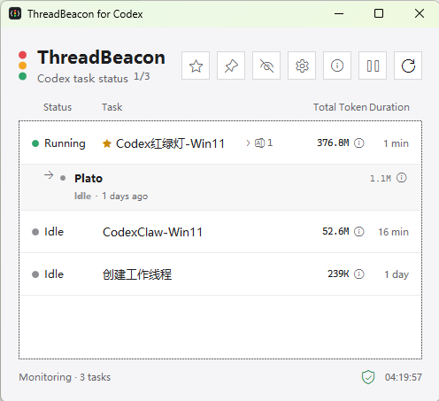
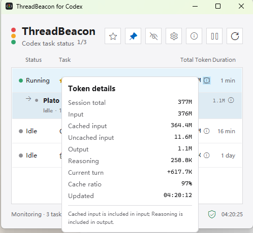
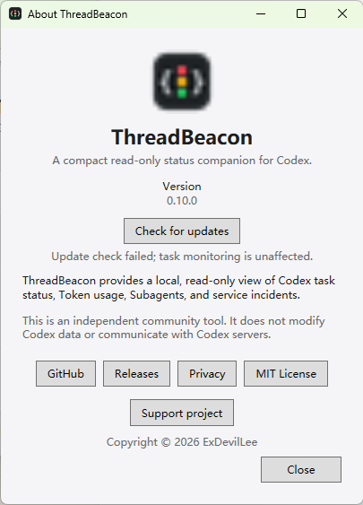
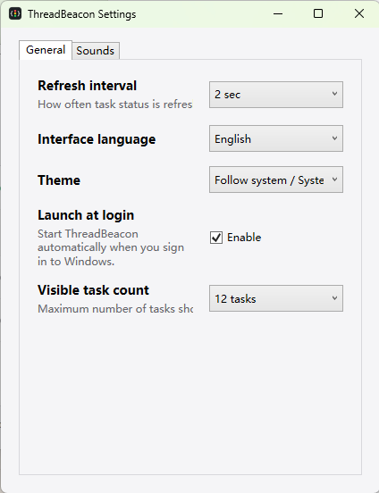
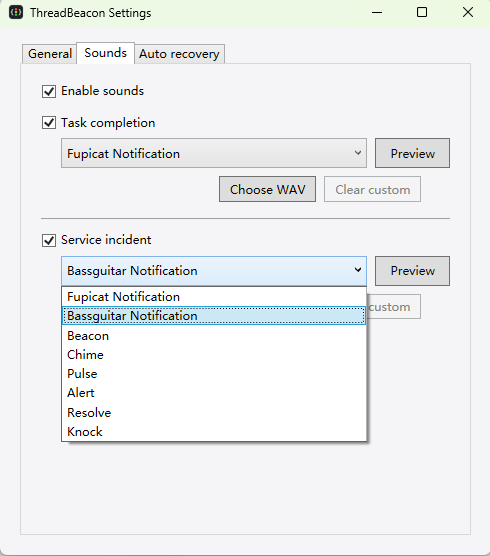
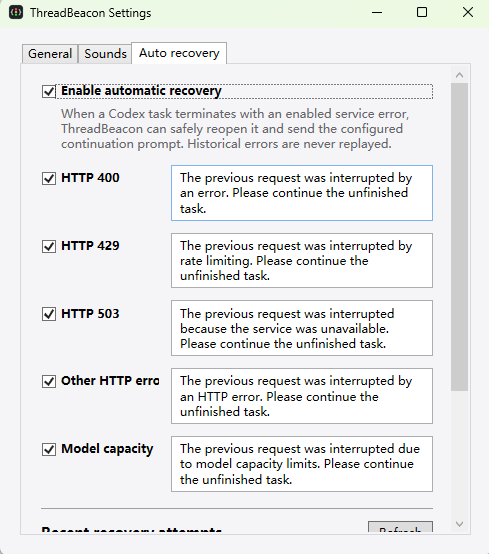

# ThreadBeacon for Codex on Windows

[简体中文](README.md) | English

ThreadBeacon is a native Windows status window for monitoring primary Codex Desktop and Codex CLI tasks at a glance.

This repository is the independent Windows implementation of [ThreadBeacon for macOS](https://github.com/ExDevilLee/codex-threadbeacon-macos). It is an unofficial community project and is not affiliated with or endorsed by OpenAI. `Codex` is a trademark of its respective owner.

## A Dedicated Small-Screen Status Board

ThreadBeacon's compact list works well on a separate portrait display, including a 7-inch secondary screen. Keep Codex interactions on the computer display, code and diffs on the main monitor, and the running, completed, and failed states of primary tasks continuously visible on the small display.


> AI-generated workspace concept. On-screen content illustrates the layout and workflow; refer to the interface screenshots below for the actual app UI.

## 30-Second Quick Start

Before starting, make sure that:

- You are running 64-bit Windows 11.
- Codex Desktop or Codex CLI is installed and has run at least one task.
- The current download is a portable technical preview. Windows may display a security prompt on first launch.

Then:

1. Download `ThreadBeacon-vX.Y.Z-win-x64.zip` from [Releases](https://github.com/ExDevilLee/codex-threadbeacon-windows/releases).
2. Extract the complete ZIP to a permanent folder instead of running the App from inside the archive.
3. Double-click `ThreadBeacon.App.exe`. If Microsoft Defender SmartScreen displays a warning, verify that the file came from this repository's Release, then select **More info** and **Run anyway**.
4. ThreadBeacon automatically reads recent local Codex primary tasks. No account, API token, or data path is required.

If no tasks appear or the footer reports a data-source problem, see [`Troubleshooting`](docs/troubleshooting-en.md) before opening a privacy-safe Issue.

## Interface Preview

| Primary task status with inline Subagent expansion | Token usage details |
| :---: | :---: |
|  |  |

| About ThreadBeacon | General settings |
| :---: | :---: |
|  |  |

| Notification and custom sounds | Auto-recovery rules and prompts |
| :---: | :---: |
|  |  |

## Status

The project is in its Windows POC stage. A Win11 probe has verified the core local data path for the currently installed Codex version. These local formats are not a stable public API.

The first end-to-end POC is now implemented: short-lived, non-pooled, read-only SQLite connections load recent unarchived primary threads and exclude genuine Subagents; a shared read of `session_index.jsonl` selects the last valid renamed title; each rollout read is limited to the final 2 MiB and retains only event types, timestamps, and numeric Token fields to derive `running`, `interrupted`, `justCompleted`, `idle`, and `unknown`. A unified loader merges these sources into snapshots, and the WPF window displays status lights, titles, cumulative Token usage, and status duration. It defaults to 8 tasks and a 2-second automatic refresh interval, with manual refresh also available. Each source degrades safely when unavailable or incompatible.

After a user stops a Codex turn, primary tasks and Subagents show a neutral `Interrupted` state. Completion wins a timestamp tie, while a later turn start returns the task to `Running`. Numeric or malformed optional completion timestamps safely fall back to the event timestamp. An interruption does not emit completion or incident sounds and does not create an automatic-recovery candidate.

Some tasks created through Codex delegation remain marked with a `subagent` source even after they appear as independent user-visible tasks. ThreadBeacon conservatively restores such a record as a primary candidate only when it has no child relationship and the healthy Rename index contains its user-visible title. Genuine direct children remain available only through their parent, and missing or unhealthy relationship/Rename data never promotes detached records.

The WPF App is connected to real local task data. A Win11 read-only concurrent-task soak ran for more than 30 minutes: 900 samples completed with no probe failures, source degradations, or App crashes, and Codex writes remained available. See the [Windows 30-minute soak record](docs/validation/2026-07-18-windows-30-minute-soak.md).

An always-visible data-source health entry now sits at the bottom-right of the window. Its popover reports the task database, Rename index, rollout, and service-log sources, aggregate rollout read successes/failures, and the last successful refresh time. Optional-source failures keep the main list running in a degraded state; a task-database failure retains the previous successful list. Diagnostics keep only fixed status categories, counts, and timestamps in memory and never display paths, task IDs, titles, or raw errors.

The first window enhancement is complete: the pin button in the top-right keeps ThreadBeacon above other normal windows. The selection is stored locally and restored after restart.

The main window remembers its last display, position, and size across launches. If that display is disconnected, the window falls back to the primary display; oversized or off-screen geometry is constrained to the current working area. The settings window has no independent saved placement and remains centered on its owner. Matching the current macOS scope, display hot-plug changes are not handled while the App is running and there is no explicit display picker.

Right-click a primary task to pin or ignore it. Status priority always outranks task pinning, while pinned tasks lead within the same status; a normal ignore rule clears automatically when the task starts a newer turn. When ignored tasks exist, a header button restores one task or all tasks. These local rules store only task IDs, ignore timestamps, and the rule type, never titles, and do not modify Codex data. Task pinning is independent of window always-on-top.

Right-clicking also favorites a primary task independently of pin and ignore. The header star switches between all tasks and favorites only, and persists the filter with the favorite task IDs locally. Favorites do not alter the existing status, pin, or recency order. If Codex archives a favorite, it remains in the watchlist with a neutral `Archived` state while retaining any available renamed title and Token data. Archived favorites do not query 429/503 logs or emit completion or incident sounds.

The middle header button temporarily pauses or resumes automatic monitoring. Manual refresh remains available while paused; resuming refreshes immediately, and every App launch starts with monitoring active. This control only affects ThreadBeacon's local read-only refresh and does not pause Codex tasks.

The info button beside cumulative Token usage now opens Task details. It shows the primary task's model and reasoning effort before session total, input, cached input, non-cached input, output, Reasoning, current turn, cache rate, and update time. Model and reasoning effort prefer the read-only task database and independently fall back to the latest valid rollout `turn_context`; hover opens a transient popover and clicking pins it, and a pinned popover remains stable across automatic task refreshes.

Token details also show read-only rollout compression history: the completed compression count and the latest completion time. A task without compression events shows `0` and `-`.

The General settings tab also provides live compaction status as an opt-in feature. Enabling it structurally merges `PreCompact` and `PostCompact` into `%CODEX_HOME%\hooks.json` and installs a separate bridge under `%LOCALAPPDATA%\ThreadBeacon\hooks\v1`. Existing configuration is backed up before installation; Check validates the current state; Disable removes only ThreadBeacon-owned handlers and preserves every other Hook. Invalid JSON, reparse points, concurrent edits, and inline Hooks in `config.toml` fail closed without overwriting the source configuration.

Each active marker contains only session ID, turn ID, the `manual`/`auto` trigger, and a local start time, with a 15-minute stale-marker limit. The bridge discards transcript paths, working directories, model names, compression summaries, conversation text, and Reasoning. Codex may still ask the user to review and trust the Hook command.

The gear button opens a separate settings window. Its General tab offers 1, 2, 5, or 10-second refresh intervals, maximum task counts of 4, 8, 12, or 20, and a Launch at login switch; changes are saved and applied immediately without altering the paused state. Launch at login writes only the current-user `HKCU\Software\Microsoft\Windows\CurrentVersion\Run\ThreadBeacon` value and removes it when disabled; an unavailable registry is handled as a non-blocking settings failure. The Sounds tab provides the same eight built-in tones as the macOS version, including preview playback. New installations default to Chime for task completion and Alert for 429/503 incidents; either notification can independently use any of the eight sounds. A sound plays once only when an automatic refresh observes a new reliable `task_complete` event; multiple completions in one refresh batch are coalesced. App startup, manual refresh, monitoring resume, and task-count changes establish a baseline and never replay historical completions. Display preferences are stored in `%LOCALAPPDATA%\ThreadBeacon\display-settings.json`; sound preferences and at most 256 derived event IDs also stay local. These files contain no task titles, conversation bodies, Token details, or Codex paths.

The settings window also supports Simplified Chinese, English, and System language preferences. The preference is stored as a stable semantic value, and switching languages updates both the main and settings windows immediately. Task titles, Agent aliases, model names, HTTP status codes, and other raw Codex data remain unchanged. Unsupported system locales fall back to English, while missing or invalid language settings fall back to System.

The Auto recovery tab provides an opt-in continuation workflow for terminal HTTP 400, HTTP 429, other HTTP 4xx/5xx, model-capacity failures, and final stream disconnects after reconnect attempts are exhausted; HTTP 503 remains disabled by default. Every rule has an independent switch and a prompt of at most 500 characters. The connection-interrupted rule defaults on, but it cannot run unless the master switch is explicitly enabled. Startup establishes a baseline and never replays historical failures. ThreadBeacon always requires exactly one Codex window. If Codex is already foreground, recovery may reuse the current task only when exactly one app-header title matches the expected Rename title and the only composer is readable and empty; drafts, ambiguous titles, missing or multiple composers, and unreadable content fail closed. Other cases retain ID deep-link navigation, exact target-title confirmation, a changed empty composer, and one structurally verified send button. ThreadBeacon invokes Send once and never retries; the result is confirmed from the target rollout. After unattended recovery, it restores the previously foreground application only if the same Codex process is still foreground; a user focus change is never overridden. Settings and at most 100 history entries stay local. Failed entries add only stable diagnostic codes and exclude prompts, titles, paths, composer text, application identities, UI trees, and raw errors.

Double-click an unarchived primary task row to open that task in the installed Codex App. Navigation reuses the same ID deep link, exact renamed-title check, changed composer check, and draft-safe empty-composer preflight, but never types or sends text. Archived favorite watchlist rows do not navigate; double-clicking the Subagent or Token-detail buttons also keeps their existing behavior.

The information button in the title bar opens a single-instance About window with the App icon, runtime version, project purpose, and independent-community disclaimer, plus GitHub, Releases, Privacy, MIT License, and Support project links. The support page includes non-financial ways to help plus completely optional WeChat Pay and Alipay sponsorship; sponsorship unlocks no features, and payment QR codes never appear in the App's main window. Those links are handed to the default browser only after an explicit user click.

After startup, the App silently checks GitHub Releases once, including prereleases. If a newer release is found, an update icon appears in the footer; About also provides manual checking and retry. A failed check does not affect task monitoring, sounds, or data-source health, and the App never downloads or installs updates automatically.

Theme preferences are available in the General tab with `System`, `Light`, and `Dark` modes. New installations default to `System`, which follows the Windows app appearance setting. Choosing `Light` or `Dark` applies immediately to the main window, settings window, and open detail surfaces; the selected mode is stored locally and restored after restart. This milestone does not add custom colors or a dedicated high-contrast theme.

## Color-blind-safe Status Indicators

The General tab offers optional color-blind-safe status indicators. When enabled, main tasks and Subagents retain their status color and text while using distinct shapes for Error, Action, Warning, Running, Interrupted, Done, Idle, and Unknown. The option is off by default, applies immediately, and persists across restarts; its fixed-size status slot prevents layout shifts. The data-source health shield already combines color, shape, and text, so this setting does not change it.

The App now also monitors HTTP 400/429/503 service incidents, model-capacity failures, and final stream disconnects after reconnect attempts are exhausted for currently visible primary tasks. Active retries appear as a yellow “Service incident.” A reconnect `5/5` remains a warning until the same turn records the exact final disconnect; only then does the row become a red “Service failure” with “Connection interrupted · Retry 5/5.” A disconnect without exhausted same-turn evidence is not guessed to be terminal. A later HTTP 200 in the same turn or a newer rollout lifecycle event clears the stale incident. Each incident episode can play one independently configurable warning sound and shares the baseline and 256-entry local derived-ID history with completion events.

The Sounds tab supports choosing, previewing, and clearing a local WAV file independently for completion and service-incident notifications. If a custom file is unavailable or invalid, playback automatically falls back to the selected built-in tone.

A primary task that created Subagents shows a neutral branch icon and `running/history total`, such as `2/27`; zero total reserves no space. The numerator counts only direct children whose rollout remains confirmed `Running` by the existing 120-second freshness policy. It does not use the relationship table's `open` value and does not recurse. To keep the two-second refresh bounded, a collapsed row queries only children updated in the last 120 seconds and reads those rollout tails; expanding loads full direct-child details on demand and reuses observations already parsed in that refresh. Expanded rows show `semantic task name | title`, derived status, recent activity, cumulative Token usage, and details for role, model, reasoning effort, and numeric Token fields. The semantic task name is generated from the final `agent_path` component, so `/root/fix_external_sync` becomes `Fix external sync`; older records fall back to the Agent nickname, and a database without the column degrades safely. Conversation bodies and deeper descendants are never read or displayed.

The window subtitle shows `running tasks/current visible tasks`, such as `1/7`. Only primary snapshots with the derived `Running` status contribute to the numerator, and the denominator matches the primary snapshots currently displayed. Pausing preserves the last successful count; manual refresh or monitoring resume recalculates it.

The first POC is deliberately limited to:

- Reading 8 recent unarchived primary threads by default, with configurable limits of 4, 8, 12, or 20, while excluding genuine Subagents and restoring only unlinked records with a visible Rename.
- Using the latest renamed title from `session_index.jsonl`.
- Deriving task status from rollout JSONL tails.
- Displaying the primary task model, reasoning effort, and cumulative Token usage in a body-free details popover.
- Playing a configurable built-in sound for new task completions observed by automatic refresh.
- Detecting HTTP 400/429/503 and model-capacity incidents for visible primary tasks from read-only local logs.
- Showing running direct Subagents over their historical total and expanding direct children on demand.
- Showing running primary tasks over currently visible primary tasks in the subtitle.
- Pinning, temporarily ignoring, automatically restoring on a newer turn, and manually restoring primary tasks.
- Favoriting independently, filtering to favorites, and watching archived favorites.
- Showing four local data-source states, aggregate rollout read counts, and the last successful refresh time.
- Restoring the main window's last display, position, and size with safe disconnected-display fallback.
- Refreshing every 2 seconds by default, with configurable 1, 2, 5, or 10-second intervals and a manual refresh option.
- Opening SQLite databases in read-only mode.
- Never reading conversation bodies or writing SQLite, session-index, or rollout files. Update checks use the public GitHub API; opt-in auto recovery submits only the configured prompt through the installed Codex App and does not call Codex network APIs directly.

Other failure/warning sounds, Subagent alerts and Token aggregation, and the system tray remain deferred.

## Technology

- .NET 9
- WPF
- xUnit

## Repository Layout

- `src/ThreadBeacon.Core`: models, read-only data access, parsers, and status rules; no WPF dependency.
- `src/ThreadBeacon.App`: Windows UI and platform integration.
- `tests/ThreadBeacon.Core.Tests`: core behavior and compatibility tests.
- `tests/ThreadBeacon.App.Tests`: local settings and window interaction state tests.
- `tools/ThreadBeacon.Probe`: a local probe that only reports source health and thread count.
- `docs`: Windows probe, design notes, and the [macOS parity ledger](docs/macos-parity.md).

The macOS repository is a behavioral reference only and is not a source dependency.

## Build and Run

```powershell
dotnet restore
dotnet build --configuration Release
dotnet test --configuration Release
dotnet run --project src/ThreadBeacon.App
dotnet run --project tools/ThreadBeacon.Probe --configuration Release
```

## Versioned Release

The repository root `VERSION` file is the single source of truth for the app version. Stable releases use a matching Git tag such as `v0.1.0`. Generate a self-contained `win-x64` release package with:

```powershell
.\script\publish_release.ps1
```

The script writes a portable package ZIP and the published executable under `artifacts/release/<tag>`. The ZIP is the recommended distribution because it includes the bundled sound assets and optional live-compaction Hook Bridge alongside the executable; the single-file executable extracts the same Bridge at runtime.

Pushing a `v*` tag also starts the repository GitHub Actions release workflow. It rebuilds the assets on a clean Windows runner and publishes both files to the matching GitHub Release.

## App Icon

<p align="center">
  
</p>

The Windows App shares the `B1 Graphite / Code Beacon` icon with the macOS version: a graphite rounded square, white code braces, and a vertical red-yellow-green beacon.

- `Resources/AppIcon-1024.png`: the shared 1024px PNG master.
- `Resources/AppIcon.ico`: the Windows icon containing 16, 24, 32, 48, 64, 128, and 256px frames.

Regenerate the ICO in PowerShell:

```powershell
.\script\generate_app_icon.ps1
```

## Sound Assets

Beacon, Chime, Pulse, Alert, Resolve, and Knock are generated deterministically by the author's project scripts. Fupicat Notification and Bassguitar Notification are optional CC0 sounds from Freesound and are not defaults. Windows reuses the same WAV files as macOS, and the Release build copies them to `Resources/Sounds`; see [THIRD_PARTY_NOTICES.md](THIRD_PARTY_NOTICES.md) for sources and processing details.

## Privacy

Service-incident monitoring transiently parses only three allow-listed log targets and retains only the turn episode ID, HTTP status, retry progress, phase, and timestamp. It explicitly excludes transport logs that may contain request context. Conversation messages, responses, reasoning summaries, and complete requests are never read or displayed.

Task details retain only model names, reasoning effort, and numeric Token fields. Later blank rollout fields never erase the latest valid metadata.

See [PRIVACY.md](PRIVACY.md) for the exact local data scope and processing boundaries.

## Help And Contributing

- Troubleshooting: [`English`](docs/troubleshooting-en.md) / [`简体中文`](docs/troubleshooting.md)
- Release history: [CHANGELOG.md](CHANGELOG.md)
- Contributing: [CONTRIBUTING.md](CONTRIBUTING.md)
- Security reporting: [SECURITY.md](SECURITY.md)

## License

[MIT](LICENSE)
