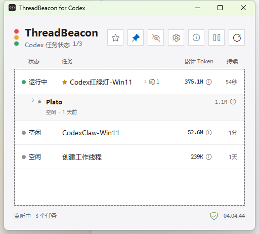
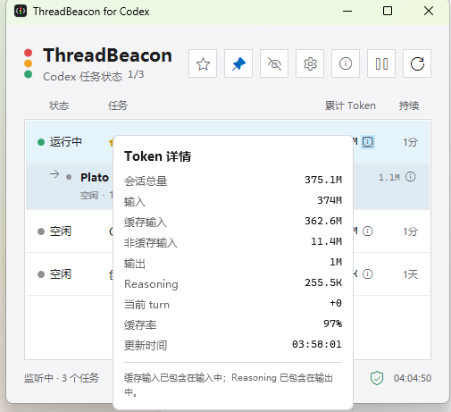
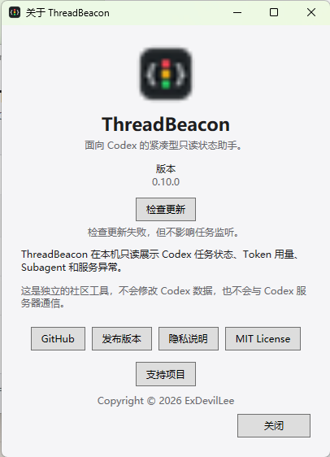
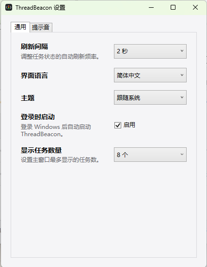

# ThreadBeacon for Codex on Windows

简体中文 | [English](README-EN.md)

ThreadBeacon 是一个用于集中查看 Codex Desktop 与 Codex CLI 主任务状态的原生 Windows 小窗口。

本项目是 [ThreadBeacon for macOS](https://github.com/ExDevilLee/codex-threadbeacon-macos) 的独立 Windows 平台实现。它是非官方社区工具，与 OpenAI 无隶属或背书关系。`Codex` 是其相应权利人的商标。

## 30 秒快速开始

使用前请确认：

- 使用 Windows 11 x64。
- 已安装 Codex Desktop 或 Codex CLI，并且至少运行过一个任务。
- 当前下载包是免安装的技术预览版，首次启动时 Windows 可能显示安全提示。

操作步骤：

1. 从 [Releases](https://github.com/ExDevilLee/codex-threadbeacon-windows/releases) 下载 `ThreadBeacon-vX.Y.Z-win-x64.zip`。
2. 将 ZIP 完整解压到一个固定目录，不要直接在压缩包内运行 App。
3. 双击 `ThreadBeacon.App.exe`；如果 Microsoft Defender SmartScreen 显示提示，请确认文件来自本仓库的 Release 后选择“更多信息”与“仍要运行”。
4. ThreadBeacon 会自动读取本机最近的 Codex 主任务；无需填写账号、API Token 或数据路径。

如果窗口没有任务或底部显示数据源异常，请先查看 [`故障排查`](docs/troubleshooting.md)，再提交不包含私人数据的 Issue。

## 界面预览

| 主任务状态与 Subagent 行内展开 | Token 使用详情 |
| :---: | :---: |
|  |  |

| 关于 ThreadBeacon | 通用设置 |
| :---: | :---: |
|  |  |

## 当前状态

项目处于 Windows POC 阶段。Win11 实机探测已经确认当前 Codex 版本的核心数据链路可用，但 Codex 本地文件格式不是公开稳定契约。

首版主链路 POC 已贯通：以短生命周期、无连接池的 SQLite read-only 连接读取最近的未归档主任务并排除真正的 Subagent；共享读取 `session_index.jsonl`，为每个任务选择最后一条有效 rename 标题；每个 rollout 最多读取文件尾部 2 MiB，只提取事件类型、时间和 Token 数字字段，用于推导 `running`、`justCompleted`、`idle` 与 `unknown`。统一 Loader 将这些数据合并为任务快照，WPF 窗口显示状态灯、标题、累计 Token 和状态持续时间，默认每 2 秒自动刷新并显示 8 个任务，同时支持手动刷新。各数据源异常时会安全降级。

部分由 Codex 委派创建、随后作为独立任务显示的记录仍会保留 `subagent` 来源标记。如果这类记录未出现在父子关系表中，且健康的 Rename 索引包含其用户可见标题，ThreadBeacon 会将它保守地恢复为主任务候选。真正的直接子任务仍只在父任务下按需展开；关系表或 Rename 索引缺失、异常时不会提升孤立记录。

当前 WPF App 已接入本机真实任务数据。Win11 实机已完成超过 30 分钟的并行任务只读稳定性验证：900 次采样无探测失败、无数据源降级、无 App 崩溃，且未阻塞 Codex 写入。验证结果见 [Windows 30 分钟稳定性记录](docs/validation/2026-07-18-windows-30-minute-soak.md)。

窗口底部右侧始终显示数据源健康入口。点击后可查看任务数据库、Rename 索引、Rollout 和服务日志四类来源的状态、Rollout 成功/失败读取数量及最近一次成功刷新时间。可选来源异常时主列表继续运行并显示“部分降级”；任务数据库不可用时保留上一次成功的任务列表。诊断只在内存中保存固定状态类别、计数和时间，不展示路径、任务 ID、标题或原始错误。

已完成的窗口增强：右上角图钉按钮可让 ThreadBeacon 保持在其他普通窗口之前；置顶状态会保存到本机设置，并在重启后恢复。

主窗口会记住最后所在显示器、位置和尺寸，并在下次启动时恢复。原显示器断开时会回退到主显示器；保存的尺寸过大或位置超出当前工作区时会自动约束到可见范围。设置窗口不保存独立位置，始终相对主窗口居中。当前版本与 macOS 保持相同边界，不在运行期间响应显示器热插拔，也不提供显式显示器选择器。

右键主任务可置顶或忽略。状态优先级始终高于任务置顶，同一状态内置顶任务优先；普通忽略会在该任务出现新 turn 时自动恢复。存在已忽略任务时，标题栏会显示管理按钮，可逐项恢复或全部恢复。任务规则只在本机保存任务 ID、忽略时间和规则类型，不写入标题，也不修改 Codex 数据。任务级置顶与窗口“钉在最前面”相互独立。

右键主任务也可独立收藏。标题栏星形按钮在全部任务与仅收藏视图之间切换，筛选状态会随收藏任务 ID 一起保存在本机。收藏不会改变默认状态、置顶与时间排序；任务被 Codex 归档后仍可留在收藏观察列表中，以中性的“已归档”状态显示，并保留可读取的 rename 标题和 Token 数据。归档收藏不查询 429/503 日志，也不会触发完成或异常提示音。

标题栏中间的暂停/恢复按钮可临时停止自动监听。暂停期间仍可手动刷新；恢复时会立即刷新一次，App 重启后默认恢复自动监听。该控制只影响 ThreadBeacon 的本地只读刷新，不会暂停 Codex 任务。

累计 Token 后的信息按钮可查看会话总量、输入、缓存输入、非缓存输入、输出、Reasoning、当前 turn、缓存率和更新时间。悬停会短暂显示详情，点击可固定弹窗；任务列表自动刷新时，已打开的固定弹窗保持稳定。

右上角齿轮按钮打开独立设置窗口。“通用”页可将刷新间隔设为 1、2、5 或 10 秒，并将主窗口最大任务数设为 4、8、12 或 20；修改会立即保存并生效，且不会改变暂停状态。“提示音”页提供与 macOS 版本一致的八种内置音色及试听功能。新安装默认使用 Chime 作为完成音、Alert 作为 429/503 异常音，两类通知都可独立选择八种音色中的任一种。只有自动刷新发现新的可靠 `task_complete` 事件时才播放一次；同一批多个完成事件会合并为一次提示。App 启动、手动刷新、恢复监听和任务数量调整时只建立完成事件基线，不会补播历史任务。显示偏好保存在 `%LOCALAPPDATA%\ThreadBeacon\display-settings.json`，声音开关、所选音色和最多 256 个派生事件 ID 也只保存在本机；这些文件不保存任务标题、正文、Token 详情或 Codex 路径。

设置窗口还支持简体中文、English 和“跟随系统”三种界面语言，并可在“通用”页开启“登录时启动”。开启后仅为当前 Windows 用户写入 `HKCU\Software\Microsoft\Windows\CurrentVersion\Run\ThreadBeacon`，关闭后立即删除；注册表不可用时设置页会降级而不会阻塞主程序。语言偏好保存为稳定语义值，切换会立即更新主窗口和设置窗口；任务标题、Agent 名称、模型名称、HTTP 状态码和其他 Codex 原始数据保持原样。未识别的系统语言回退到 English，缺失或损坏的语言设置回退到跟随系统。

标题栏的信息按钮打开单实例“关于”窗口，显示 App 图标、当前运行版本、项目定位和非官方说明，并提供 GitHub、Releases、隐私说明、MIT License 与“支持项目”入口。支持页只列出 Star、分享、Issue 和贡献代码等方式，当前没有付费赞助或功能解锁。只有用户主动点击这些链接时才会交给默认浏览器打开。

App 启动后会静默检查一次 GitHub Releases（包含预发布版本），发现比当前版本新的发布时在底栏显示更新图标；About 窗口也支持手动检查和重试。更新检查失败不会影响任务列表、提示音或数据源健康状态，App 不会自动下载或安装更新。

App 现在也会监控当前可见主任务的 HTTP 400/429/503 服务异常和模型容量不足错误。HTTP 429/503 重试阶段以黄色“服务异常”显示状态码与重试进度；HTTP 400、重试耗尽或模型容量不足时变为红色“服务失败”。模型容量不足会显示独立详情，同一 turn 后续 HTTP 200 或较新的 rollout 生命周期事件会清除旧异常。每个异常 episode 最多播放一次独立可配置的提示音；异常与完成事件共享基线和 256 条本地派生 ID 历史。

“提示音”页支持为完成和服务异常分别选择本地 WAV 文件、试听和清除。自定义文件不可访问或格式无效时，会自动回退到各自选择的内置音色。

创建过 Subagent 的主任务会在标题右侧显示中性的分支图标和直接 Subagent 总数。该数字来自父子关系表，是历史关系数量，不代表当前正在运行的数量；数量为 0 时不显示且不保留空白。点击数量可在主任务下行内展开直接子任务，默认显示 `Agent 别名 | 标题`、推导状态、最近活动和累计 Token，详情中显示角色、模型、Reasoning 与 Token 数字明细。只有当前可见且已展开的主任务会读取子任务记录和 rollout 尾部；收起后停止读取，不显示第二层子任务，也不读取正文。

窗口副标题显示 `运行中任务数/当前显示总数`，例如 `1/7`。分子只统计派生状态为 `Running` 的主任务，分母与列表中当前显示的主任务快照一致；暂停监听时保留上次成功刷新结果，手动刷新或恢复监听后重新计算。

第一阶段严格收敛为：

- 默认读取最近 8 个未归档主任务并排除真正的 Subagent，可在设置中选择最多显示 4、8、12 或 20 个；无父关系且有可见 Rename 的孤立记录可恢复为主任务候选。
- 优先显示 `session_index.jsonl` 中 rename 后的标题。
- 从 rollout JSONL 尾部推导状态并显示状态灯。
- 显示会话累计 Token，并提供只包含数字统计的 Token 详情弹窗。
- 对自动刷新发现的新任务完成事件播放可配置的内置提示音。
- 从只读本地日志中识别当前可见主任务的 HTTP 400/429/503 与模型容量异常。
- 在主任务标题右侧显示非零的直接 Subagent 历史总数，并支持按需行内展开直接子任务。
- 在窗口副标题显示运行中主任务数与当前显示总数。
- 支持主任务右键置顶、临时忽略、下一 turn 自动恢复和手动恢复。
- 支持独立收藏、仅收藏筛选和已归档收藏观察列表。
- 显示四类本地数据源健康状态、Rollout 读取计数和最近成功刷新时间。
- 在重启后恢复主窗口最后所在显示器、位置和尺寸，并安全处理断开的显示器。
- 默认每 2 秒自动刷新，可在设置中选择 1、2、5 或 10 秒，并支持手动刷新。
- SQLite 全程只读。
- 不读取正文，也不写入 SQLite、session index 或 rollout；更新检查只访问公开 GitHub API，自动恢复仅在用户明确开启后通过已安装的 Codex App 提交配置提示，不直接调用 Codex 网络 API。

其他失败/警告事件提示音、Subagent 异常提示与 Token 聚合和系统托盘仍未实现。

## 自动恢复

设置窗口的“自动恢复”页提供默认关闭的续接能力，覆盖终止型 HTTP 400、HTTP 429、其他 HTTP 4xx/5xx 和模型容量异常，HTTP 503 默认关闭。每类异常可独立启用并配置不超过 500 字的提示词。App 启动时只建立基线，不补发历史故障。

发送前必须同时满足：Codex 窗口唯一、通过任务 ID 深链定位、顶部 Rename 标题精确匹配、composer 实例已切换且为空、发送按钮结构唯一。每次只调用一次发送，绝不因超时重试；结果通过目标 rollout 中的精确用户消息与 `task_started` 确认。设置与最多 100 条恢复记录只保存在本机，记录不包含提示词、任务标题、Codex 路径或原始异常。

双击主任务行可在已安装的 Codex App 中打开对应任务。导航复用任务 ID 深链、精确 Rename 标题、composer 实例切换和空 composer 预检，但不会输入或发送文字；双击 Subagent 展开或 Token 详情按钮只执行按钮原有操作，不触发任务导航。

## 技术栈

- .NET 9
- WPF
- xUnit

## 仓库结构

- `src/ThreadBeacon.Core`：模型、只读数据访问、解析与状态规则，不引用 WPF。
- `src/ThreadBeacon.App`：Windows 窗口、交互和平台集成。
- `tests/ThreadBeacon.Core.Tests`：核心规则与数据兼容性测试。
- `tests/ThreadBeacon.App.Tests`：本机设置与窗口交互状态测试。
- `tools/ThreadBeacon.Probe`：只输出数据源健康状态和任务数量的本机探测工具。
- `docs`：Windows 数据探测和设计记录。

macOS 仓库只作为行为参考，不建立源码级依赖。

## 构建与运行

```powershell
dotnet restore
dotnet build --configuration Release
dotnet test --configuration Release
dotnet run --project src/ThreadBeacon.App
dotnet run --project tools/ThreadBeacon.Probe --configuration Release
```

## 版本化发布

仓库根目录的 `VERSION` 是 App 版本号的唯一来源。稳定版本使用相同版本号的 Git tag，例如 `v0.1.0`。生成自包含的 `win-x64` 发布包：

```powershell
.\script\publish_release.ps1
```

脚本会在 `artifacts/release/<tag>` 下生成便携 ZIP 和发布 EXE。推荐分发 ZIP，因为其中包含 EXE 及配套的内置提示音资源。

推送 `v*` tag 后，仓库 GitHub Actions 会在干净的 Windows runner 上重新构建，并将两个文件发布到对应的 GitHub Release。

## App 图标

<p align="center">
  
</p>

Windows App 与 macOS 版本共享 `B1 Graphite / Code Beacon` 图标：石墨黑圆角底板、白色代码括号和纵向红黄绿三灯。

- `Resources/AppIcon-1024.png`：跨平台 1024px PNG 母版。
- `Resources/AppIcon.ico`：包含 16、24、32、48、64、128 和 256px 帧的 Windows 图标。

可在 PowerShell 中重复生成 ICO：

```powershell
.\script\generate_app_icon.ps1
```

## 提示音资源

Beacon、Chime、Pulse、Alert、Resolve 和 Knock 是由作者项目脚本确定性生成的短音效。Fupicat Notification 与 Bassguitar Notification 是来自 Freesound 的 CC0 可选素材，不作为默认声音。Windows 直接复用与 macOS 相同的 WAV 文件，Release 构建会将它们复制到 `Resources/Sounds`；第三方来源和处理说明见 [THIRD_PARTY_NOTICES.md](THIRD_PARTY_NOTICES.md)。

## 隐私原则

- 只读取本机 Codex 数据，不修改 SQLite、session index 或 rollout 文件。
- 不读取或显示用户消息、助手回复正文、reasoning summary 或完整请求；服务异常监控只短暂解析三类白名单日志，并明确排除可能包含请求上下文的 transport 日志。
- 不启动网络服务，不上传任务数据。
- 数据源缺失、锁定或升级时安全降级，不影响 Codex 正常写入。

完整数据范围和处理边界见 [PRIVACY.md](PRIVACY.md)。

## 主题

设置窗口的“通用”页支持“跟随系统”“浅色”和“深色”三种主题。新安装默认跟随 Windows 应用外观；选择浅色或深色后会立即更新主窗口、设置窗口和已打开的详情界面，并在重启后保留。当前版本不提供自定义颜色或独立的高对比度主题。

## 帮助与参与

- 常见问题：[`中文故障排查`](docs/troubleshooting.md) / [`English`](docs/troubleshooting-en.md)
- 版本记录：[CHANGELOG.md](CHANGELOG.md)
- 参与开发：[CONTRIBUTING.md](CONTRIBUTING.md)
- 安全报告：[SECURITY.md](SECURITY.md)

## License

[MIT](LICENSE)
