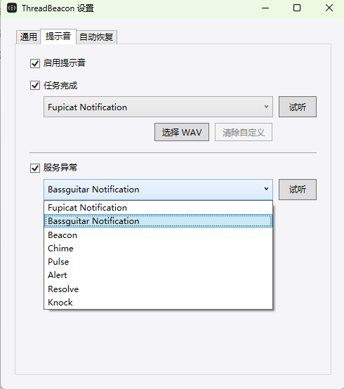
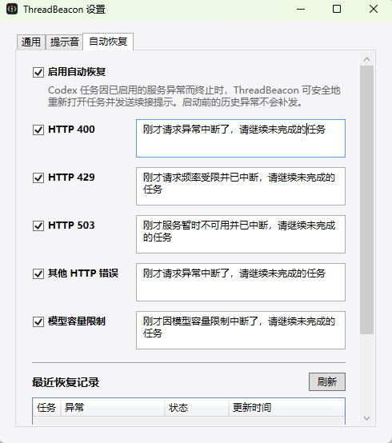

# ThreadBeacon for Codex on Windows

简体中文 | [English](README-EN.md)

[](https://github.com/ExDevilLee/codex-threadbeacon-windows/releases)

[](LICENSE)

ThreadBeacon 是一个原生 Windows 小窗口，用于集中查看 Codex Desktop 与 Codex CLI 主任务的
运行、完成、中断和异常状态。它让同时执行多个任务时不必反复切回 Codex，也适合置顶在桌面
或单独放在竖向小屏上。

本项目是非官方社区工具，与 OpenAI 无隶属或背书关系。`Codex` 是其相应权利人的商标。

## 小屏状态台

ThreadBeacon 的紧凑列表适合放在 7 英寸等竖向扩展屏上：电脑保留 Codex 交互，主显示器查看
代码和 Diff，小屏持续展示各任务状态。


> AI 生成的使用场景概念图，屏幕内容仅用于表达布局与工作流；实际界面以下方截图为准。

## 30 秒快速开始

使用前请确认：

- 使用 Windows 11 x64。
- 已安装 Codex Desktop 或 Codex CLI，并且至少运行过一个任务。
- 当前下载包是免安装的技术预览版，Windows 可能显示 Microsoft Defender SmartScreen 提示。

安装并启动：

1. 从 [GitHub Releases](https://github.com/ExDevilLee/codex-threadbeacon-windows/releases)
   下载 `ThreadBeacon-vX.Y.Z-win-x64.zip`。
2. 将 ZIP 完整解压到固定目录，不要直接在压缩包内运行。
3. 双击 `ThreadBeacon.App.exe`。若 SmartScreen 显示提示，请先确认文件来自本仓库的 Release，
   再选择“更多信息”和“仍要运行”。

ThreadBeacon 启动后会自动读取本机最近的 Codex 主任务，无需填写账号、API Token 或数据路径。
窗口没有任务或底部显示数据源异常时，请查看
[`故障排查`](docs/troubleshooting.md)。

## 界面预览

| 主任务状态与 Subagent 行内展开 | Token 使用详情 |
| :---: | :---: |
|  |  |

| 通用 Settings | 关于 ThreadBeacon |
| :---: | :---: |
|  |  |

| 提示音与自定义音频 | 自动恢复规则与记录 |
| :---: | :---: |
|  |  |

## 核心功能

### 一眼查看任务状态

- 默认每 2 秒刷新，可配置为 `1 / 2 / 5 / 10 秒`，也可暂停监听或手动刷新。
- 显示 Codex rename 后的任务名称、状态持续时间，以及运行任务数与当前显示任务数。
- 识别运行中、刚完成、已中断、服务异常、空闲与未知状态；色盲安全形状默认开启。
- “刚完成”状态可保留 `1～5 分钟`，状态优先级始终高于手工置顶。
- 窗口可保持在最前面，并在重启后恢复显示器、位置和尺寸。

### Subagent 与 Token 概览

- 主任务显示直接 Subagent 的`运行中数/历史总数`，例如`2/27`，点击后可行内展开。
- 展开行显示 Agent 名称、任务标题、状态、最近活动、模型、推理强度和 Token。
- 主列表紧凑显示累计 Token；任务详情展示输入、缓存输入、输出、Reasoning、当前 turn、
  缓存率、模型和推理强度。
- Token 详情还显示累计压缩次数和最近完成时间；实时`压缩中`需要用户在 Settings 主动安装
  可选 Codex Hook。
- App 不读取或显示会话正文，也不聚合第二层及更深 Subagent。压缩历史、Hook 与隐私边界见
  [`实时压缩状态设计`](docs/superpowers/specs/2026-07-23-compaction-hook-design.md)。

### 异常监控与提示音

- 从本机白名单结构化日志识别 HTTP 4xx/5xx 重试与终止失败、重新连接重试耗尽，以及明确的
  模型容量异常。
- 活跃重试显示黄色警告，终止失败显示红色错误；已确认异常不会被通用完成事件覆盖。
- 完成和异常使用不同的默认提示音，也可分别关闭、试听八种内置声音或选择本地 WAV。
- 内置与第三方声音的来源和许可见 [`THIRD_PARTY_NOTICES.md`](THIRD_PARTY_NOTICES.md)，
  详细状态规则见
  [`服务异常监控设计`](docs/superpowers/specs/2026-07-19-service-incident-monitoring-design.md)。

### 可选的自动恢复

- 自动恢复默认关闭，可分别配置 HTTP 400、HTTP 429、HTTP 503、其他 HTTP 错误、模型容量
  异常和连接中断的开关与提示词；HTTP 503 默认关闭。
- 发送通过已安装 Codex App 的可见输入框完成。Windows UI Automation 必须确认唯一 Codex
  窗口、精确任务标题、空输入框和唯一发送按钮；任一条件不满足都会安全停止。
- 每类异常默认连续尝试 `3` 次，可设置 `1～20` 次或关闭熔断限制；正常完成会清零计数，
  Settings 也可解除指定任务的熔断。
- 恢复记录只保存在本机，可查看未发送、发送中、已发送、失败和已熔断结果。

### 日常管理与设置

- 支持收藏、仅显示收藏、置顶、临时忽略和恢复；收藏的归档任务仍可查看并明确标记已归档。
- 双击未归档主任务可在 Codex App 中打开对应任务；打开前同样执行唯一窗口、任务身份和
  草稿安全检查，但不会输入或发送文字。
- Settings 支持跟随系统、简体中文和 English，以及 System、Light 和 Dark 主题。
- 可配置最大显示任务数、刷新间隔、完成状态保留时间、提示音、自动恢复和登录时启动。
- 底部健康入口展示 SQLite、Rename、Rollout 和服务日志数据源状态。
- App 会检查 GitHub Releases；发现新版本时显示入口，但不会自动下载或安装。

## 下载与安装

从 [GitHub Releases](https://github.com/ExDevilLee/codex-threadbeacon-windows/releases) 下载：

```text
ThreadBeacon-vX.Y.Z-win-x64.zip
ThreadBeacon-vX.Y.Z-win-x64.exe
```

推荐使用 ZIP：完整解压后运行 `ThreadBeacon.App.exe`，包内同时包含提示音资源和可选实时压缩
状态所需的 Hook Bridge。单文件 EXE 会在运行时释放同一 Bridge，适合便携使用。

升级时先退出 ThreadBeacon，再用新版本完整替换程序文件；保留
`%LOCALAPPDATA%\ThreadBeacon` 中的 JSON 设置即可延续偏好。卸载前请在 Settings 关闭“登录时
启动”，退出 App 后删除程序目录；如需同时清除本地偏好和恢复记录，再删除上述本地数据目录。
完整步骤见 [`故障排查`](docs/troubleshooting.md)。

## 数据与隐私

- App 只在本机读取 Codex 任务 SQLite、rename 索引、rollout 尾部和三个白名单日志 target，
  用于生成状态、Token、模型和异常信息。
- App 不读取 reasoning summary、会话正文、完整请求、供应商 URL 或 request ID，不上传 Codex
  数据，也不启动网络服务。
- App 不直接修改 Codex SQLite、session index 或 rollout；数据源始终以只读方式访问。
- 自动恢复总开关默认关闭；只有用户主动启用相应规则后，App 才会通过可见 Codex 输入框
  发送用户配置的续接提示。
- 实时压缩状态为可选能力；只有用户主动启用时才会结构化修改本机 Codex Hook 配置，保留
  其他 Hook，并支持从 Settings 停用还原。
- 更新检查只请求公开 GitHub Release 元数据，不包含 Codex 数据、本机路径、设置或设备标识。
- 本地保存的数据范围、自动恢复记录和 Hook 说明见 [`PRIVACY.md`](PRIVACY.md)。

## 已知限制

- 长时间没有新 rollout 事件的未闭合任务可能暂时显示为`未知`，即使工具调用仍在执行。
- 当前无法通过只读数据源可靠区分等待授权和等待用户输入，不会从静默或会话正文猜测状态。
- Codex 的 SQLite、session index、rollout 和日志格式不是稳定公开 API，Codex 升级后可能需要适配。
- 自动恢复和双击打开依赖已安装的 Codex Desktop；窗口、标题或输入框无法唯一确认时会拒绝操作。
- 当前为免安装技术预览版，尚未提供安装器或系统托盘；首次启动可能出现 SmartScreen 提示。

更多解释和处理方式见 [`故障排查`](docs/troubleshooting.md)。

## 开发与反馈

本地构建：

```powershell
dotnet restore
dotnet build --configuration Release
dotnet test --configuration Release
dotnet run --project src/ThreadBeacon.App
```

生成自包含的 `win-x64` 发布包：

```powershell
.\script\publish_release.ps1
```

- 版本变更：[`CHANGELOG.md`](CHANGELOG.md)
- 后续候选：[`ROADMAP.md`](ROADMAP.md)
- macOS 对齐：[`docs/macos-parity.md`](docs/macos-parity.md)
- 参与开发：[`CONTRIBUTING.md`](CONTRIBUTING.md)
- 普通问题：使用 GitHub Issue Forms，请勿上传任务标题、会话内容、数据库或本机路径。
- 安全问题：见 [`SECURITY.md`](SECURITY.md)。

## App 图标


图标采用 `B1 Graphite / Code Beacon`：石墨黑圆角底板、白色代码括号和纵向红黄绿三灯。
Windows App 使用包含多尺寸帧的 [`Resources/AppIcon.ico`](Resources/AppIcon.ico)。

## 平台仓库

- macOS：[`ExDevilLee/codex-threadbeacon-macos`](https://github.com/ExDevilLee/codex-threadbeacon-macos)
- Windows：[`ExDevilLee/codex-threadbeacon-windows`](https://github.com/ExDevilLee/codex-threadbeacon-windows)

两个平台使用独立仓库、独立实现和独立发布流程；共享状态语义、功能契约和测试场景，不建立源码依赖。
