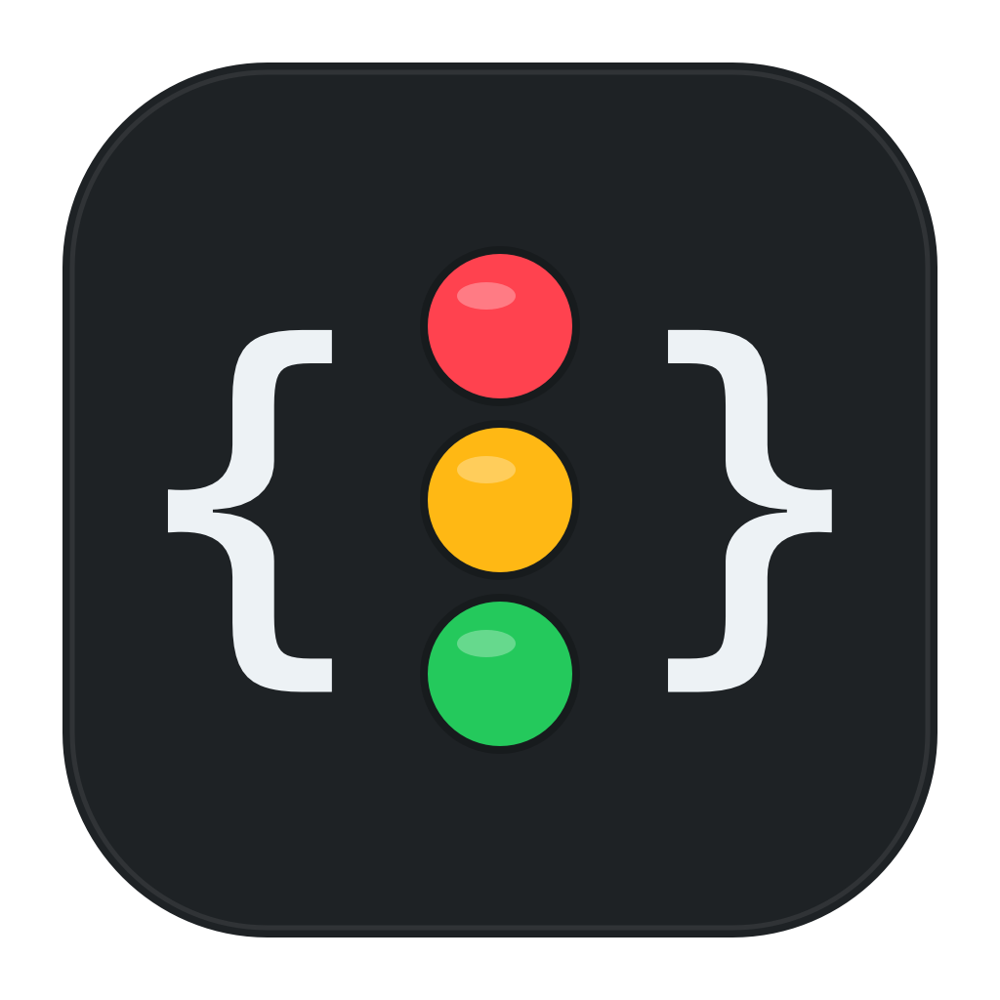

# ThreadBeacon for Codex on Windows

简体中文 | [English](README-EN.md)

ThreadBeacon 是一个用于集中查看 Codex Desktop 与 Codex CLI 主任务状态的原生 Windows 小窗口。

本项目是 [ThreadBeacon for macOS](https://github.com/ExDevilLee/codex-threadbeacon-macos) 的独立 Windows 平台实现。它是非官方社区工具，与 OpenAI 无隶属或背书关系。`Codex` 是其相应权利人的商标。

## 当前状态

项目处于 Windows POC 阶段。Win11 实机探测已经确认当前 Codex 版本的核心数据链路可用，但 Codex 本地文件格式不是公开稳定契约。

首版主链路 POC 已贯通：以短生命周期、无连接池的 SQLite read-only 连接读取最近 8 个未归档主任务并排除 Subagent；共享读取 `session_index.jsonl`，为每个任务选择最后一条有效 rename 标题；每个 rollout 最多读取文件尾部 2 MiB，只提取事件类型、时间和 Token 数字字段，用于推导 `running`、`justCompleted`、`idle` 与 `unknown`。统一 Loader 将这些数据合并为任务快照，WPF 窗口显示状态灯、标题、累计 Token 和状态持续时间，每 2 秒自动刷新并支持手动刷新。各数据源异常时会安全降级。

当前 WPF App 已接入本机真实任务数据。Win11 实机已完成超过 30 分钟的并行任务只读稳定性验证：900 次采样无探测失败、无数据源降级、无 App 崩溃，且未阻塞 Codex 写入。验证结果见 [Windows 30 分钟稳定性记录](docs/validation/2026-07-18-windows-30-minute-soak.md)。

已完成的窗口增强：右上角图钉按钮可让 ThreadBeacon 保持在其他普通窗口之前；置顶状态会保存到本机设置，并在重启后恢复。

累计 Token 后的信息按钮可查看会话总量、输入、缓存输入、非缓存输入、输出、Reasoning、当前 turn、缓存率和更新时间。悬停会短暂显示详情，点击可固定弹窗；任务列表每 2 秒刷新时，已打开的固定弹窗保持稳定。

第一阶段严格收敛为：

- 读取最近 8 个未归档主任务并排除 Subagent。
- 优先显示 `session_index.jsonl` 中 rename 后的标题。
- 从 rollout JSONL 尾部推导状态并显示状态灯。
- 显示会话累计 Token，并提供只包含数字统计的 Token 详情弹窗。
- 每 2 秒自动刷新并支持手动刷新。
- SQLite 全程只读。
- 不读取正文、不访问网络、不修改 Codex 数据。

提示音、任务置顶/忽略、Subagent 展开、429/503 和系统托盘仍未实现。

## 技术栈

- .NET 9
- WPF
- xUnit

## 仓库结构

- `src/ThreadBeacon.Core`：模型、只读数据访问、解析与状态规则，不引用 WPF。
- `src/ThreadBeacon.App`：Windows 窗口、交互和平台集成。
- `tests/ThreadBeacon.Core.Tests`：核心规则与数据兼容性测试。
- `tests/ThreadBeacon.App.Tests`：本机设置与窗口交互状态测试。
- `tools/ThreadBeacon.Probe`：只输出数据源健康状态和任务数量的本机探测工具。
- `docs`：Windows 数据探测和设计记录。

macOS 仓库只作为行为参考，不建立源码级依赖。

## 构建与运行

```powershell
dotnet restore
dotnet build --configuration Release
dotnet test --configuration Release
dotnet run --project src/ThreadBeacon.App
dotnet run --project tools/ThreadBeacon.Probe --configuration Release
```

## App 图标

<p align="center">
  
</p>

Windows App 与 macOS 版本共享 `B1 Graphite / Code Beacon` 图标：石墨黑圆角底板、白色代码括号和纵向红黄绿三灯。

- `Resources/AppIcon-1024.png`：跨平台 1024px PNG 母版。
- `Resources/AppIcon.ico`：包含 16、24、32、48、64、128 和 256px 帧的 Windows 图标。

可在 PowerShell 中重复生成 ICO：

```powershell
.\script\generate_app_icon.ps1
```

## 隐私原则

- 只读取本机 Codex 数据，不修改 SQLite、session index 或 rollout 文件。
- 不读取或显示用户消息、助手回复正文、reasoning summary 或完整请求。
- 不启动网络服务，不上传任务数据。
- 数据源缺失、锁定或升级时安全降级，不影响 Codex 正常写入。

## License

[MIT](LICENSE)
